# Gaelic Games Network
The Gaelic Games Network (GGN) is a dynamic and interactive social media platform designed specifically for enthusiasts and followers of Gaelic Athletic Association (GAA) events, teams, and topics. This application provides a space for GAA fans to connect, discuss, and engage with the vibrant GAA community.

## Contents
- [Gaelic Games Network](#gaelic-games-network)
  - [Contents](#contents)
  - [User Experience](#user-experience)
    - [Project Objective](#project-objective)
    - [User Stories](#user-stories)
      - [Sprint 1](#sprint-1)
      - [Sprint 2](#sprint-2)
      - [Sprint 3](#sprint-3)
      - [Sprint 4](#sprint-4)
      - [Sprint 5](#sprint-5)
  - [Agile Methodology](#agile-methodology)
  - [Design](#design)
    - [Typography](#typography)
    - [Wireframes](#wireframes)
    - [React Components](#react-components)
      - [NavBar](#navbar)
      - [NotFound](#notfound)
      - [Home](#home)
      - [DropDownMenu](#dropdownmenu)
      - [ProfileEditDropdown](#profileeditdropdown)
      - [Avatar](#avatar)
      - [Asset](#asset)
  - [Features](#features)
  - [Languages and Frameworks](#languages-and-frameworks)
    - [Languages](#languages)
    - [Frameworks](#frameworks)
    - [Libraries Used](#libraries-used)

## User Experience

### Project Objective
Design and develop a social media application, Gaelic Games Network (GGN), that enables users to create and share posts related to Gaelic Athletic Association (GAA) events, teams, and topics. The app should allow users to tag posts with relevant hashtags, like, comment, and follow other users. The backend will be implemented using Django REST API, while the front end will be built using React, ensuring a seamless and engaging user experience. The objective is to provide a platform for GAA enthusiasts to connect, discuss, and engage with the GAA community.

### User Stories

#### Sprint 1
1. As a **User**, I can **view a navbar on every page** so that **I can navigate between pages**
2. As a **User**, I can **navigate through pages quickly**  so that **I can view content without pages refreshing**
3. As a **User**, I can **create an account**  so that **I can gain full features of the website**
4. As a **User**, I can **sign in**  so that **I can regain site full features**
5. As a **User**, I can **tell if I’m logged in** so that **gain full functionality of the website**
6. As a **User**, I can **see sign-in and sign-out pages**  so that **I can sign in/sign up**
7. As a **User**, I can **view avatars** so that **I can identify other other users**
8. As a **User**, I can **have my logged-in status until I choose to log out** so that **my experience isn't compromised**

### Sprint 2
1. As a **Logged In User**, I can **create a post**  so that **I can share my latest updated**
2. As a **User**, I can **view a post** so that **I can learn more about that post**
3. As a **Logged In User**, I can **like a post** so that **I can show my support to other users**

### Sprint 3
1. As a **User**, I can **view the most recent posts in order by the most recently created**  so that **keep up to date with new content**
2. As a **User**, I can **search for posts that have tags** so that **I can find posts related to my search**
3. As a **Logged In User**, I can see a list of posts from users that I follow so that I can keep up to date with their posts
4. As a **User**, I can **keep scrolling through posts automatically** so that **I don’t have to click next page**

### Sprint 4
1. As a **User**, I can **view a pos** so that **I can view a list of comments on posts**
2. As a **Post Owner**, I can **edit my post** so that **I can make any corrections or update the post**
3. As a **Logged In User**, I can **post a comment on a post** so that **I can share my opinion on the post**
4. As a **User**, I can **see the date on a comment** so that **I know how old the comment is**
5. As a **User**, I can **comment on a post** so that **I can see what other users thought about the post**
6. As a **Comment Owner**, I can **delete my own comment on a post** so that **I can control my own comments**
7. As a **comment Owner**, I can **edit a comment on a post** so that **I can correct or update the comment**

### Sprint 5
1. As a **User**, I can **view other users** so that **I can see their posts and learn more about them**
2. As a **User**, I can **see a list of the most followed user profiles** so that **I can see which profiles are popular**
3. As a **User**, I can **see stats on a specific user profile page** so that **I can learn more about the user**
4. As a **Logged In User**, I can **follow and unfollow other users** so that **I can see or remove posts by specific users**
5. As a **Logged In User**, I can **edit my profile** so that **I can keep my profile update**
6. As a **User**, I can **update my username and password** so that **I can change my displayed name and keep my account secure**
7. As a **Logged In User**, I can **save a post** so that I can view it later

## Agile Methodology 
To create the Gaelic Games Network, I embraced the Agile methodology, ensuring a flexible and iterative development process. I initiated the project with a well-defined mascot method, establishing the project’s identity and vision. I then categorized features into “Must-Have” for core functionality, “Should-Have” for important but not critical elements, “Could-Have” for desirable additions, and “Won’t-Have” for items outside the project’s scope.

In addition to this, I incorporated the “Sprints” approach within Agile. By dividing the project timeline into sprints, typically lasting one to two weeks, I focused on delivering specific sets of features and functionalities. This allowed for incremental progress and regular feedback, enhancing the project’s adaptability.

GitHub Projects’ Kanban board was instrumental in tracking and managing tasks during each sprint. It provided a visual representation of the project’s status, enabling me to move tasks through various stages, prioritize them based on their importance, and react to changing requirements.

This combined approach ensured that the Gaelic Games Network was developed efficiently and effectively, accommodating adjustments and improvements along the way, ultimately leading to a successful outcome.

Link to [Gaelic Games Network GitHub Project Board](https://github.com/users/EdwardShanahan07/projects/11)

## Design

### Typography
Games Network features the [Montserrat](https://fonts.google.com/specimen/Montserrat) font as its primary typeface. Montserrat is a contemporary and elegant font that complements the website beautifully.


### Wireframes
Wireframes were created using [Figma](https://www.figma.com/).
<details>
  <summary>Home Page</summary>
  
  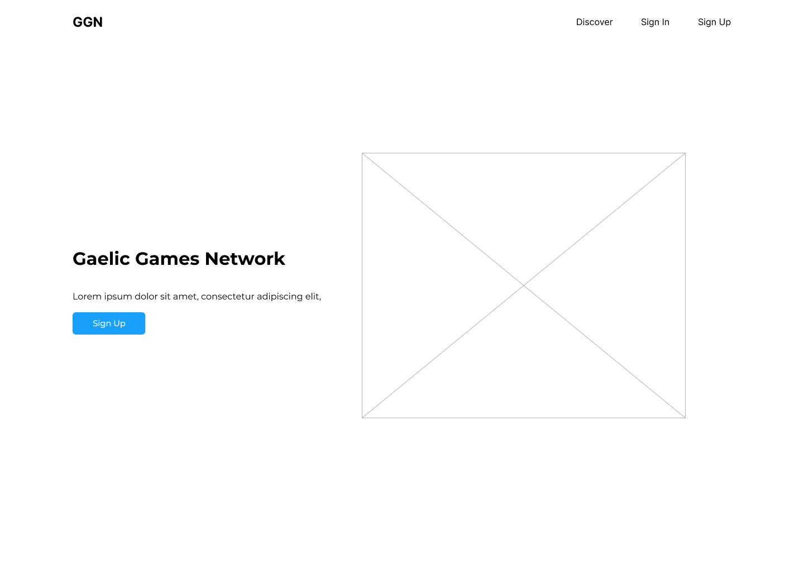
</details>

<details>
  <summary>Sign In Page</summary>
  
  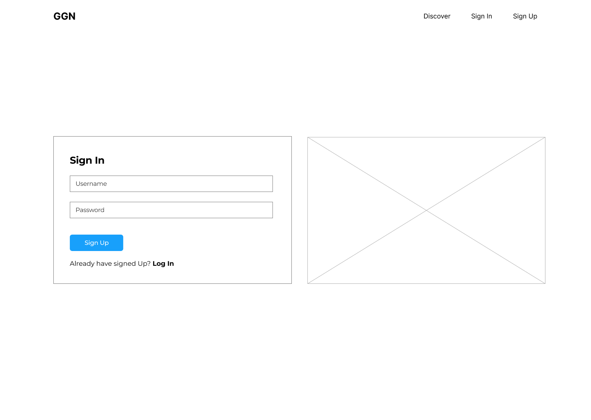
</details>

<details>
  <summary>Sign Up Page</summary>
  
  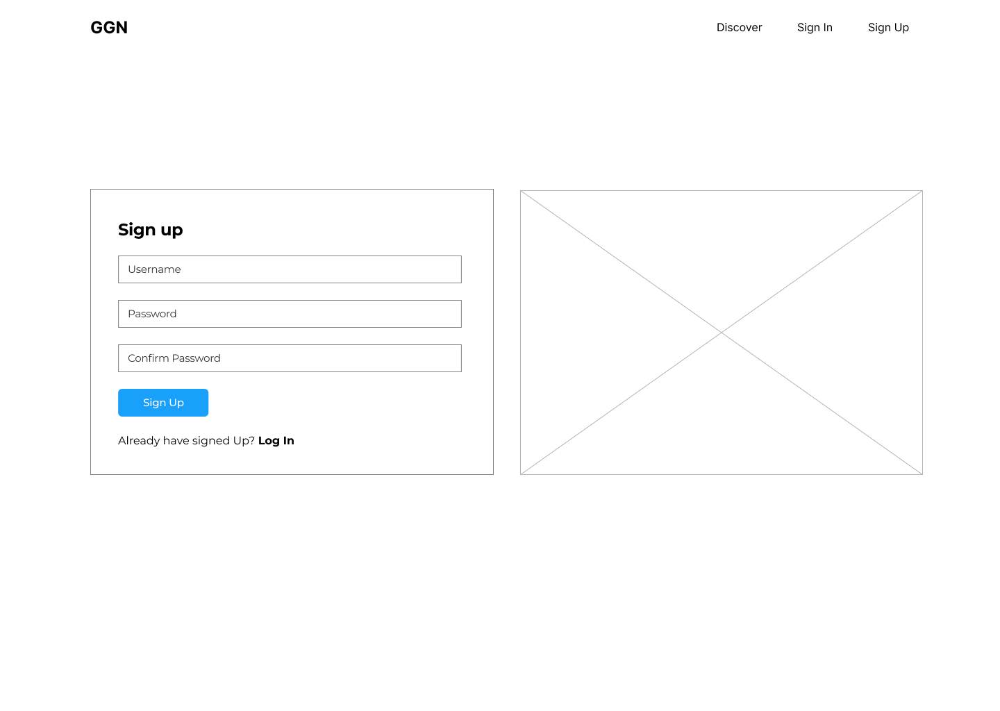
</details>

<details>
  <summary>Discover Page</summary>
  
  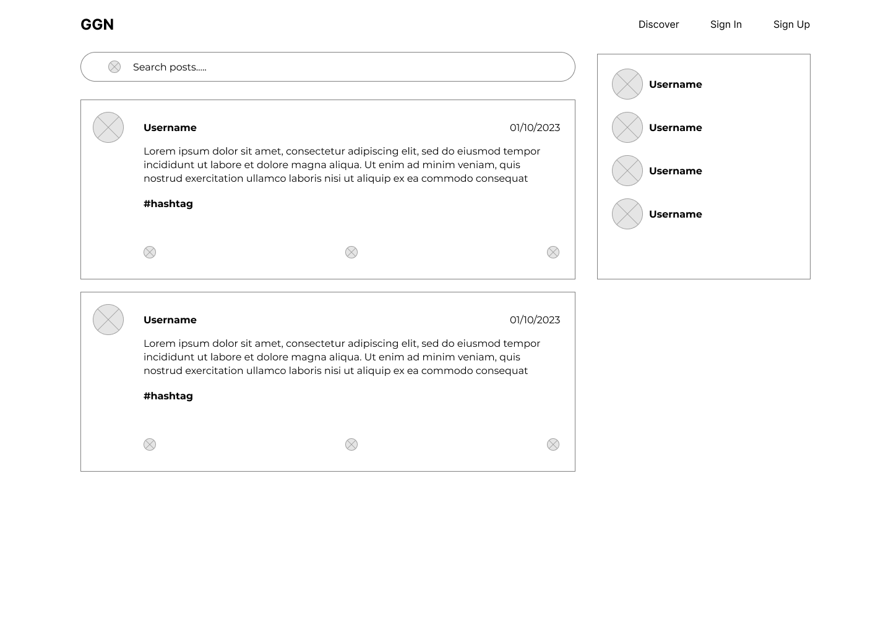
</details>

<details>
  <summary>Feed Page</summary>
  
  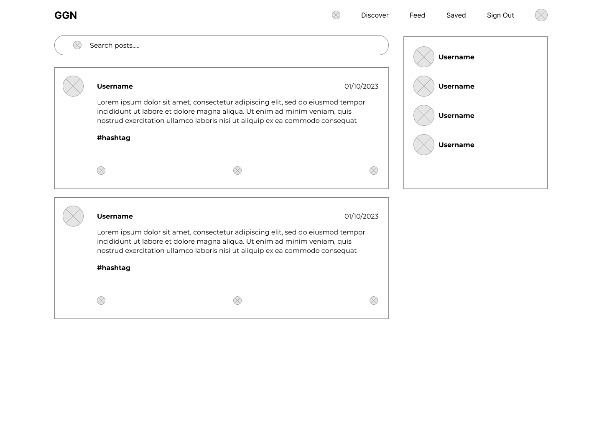
</details>

<details>
  <summary>Post Page</summary>
  
  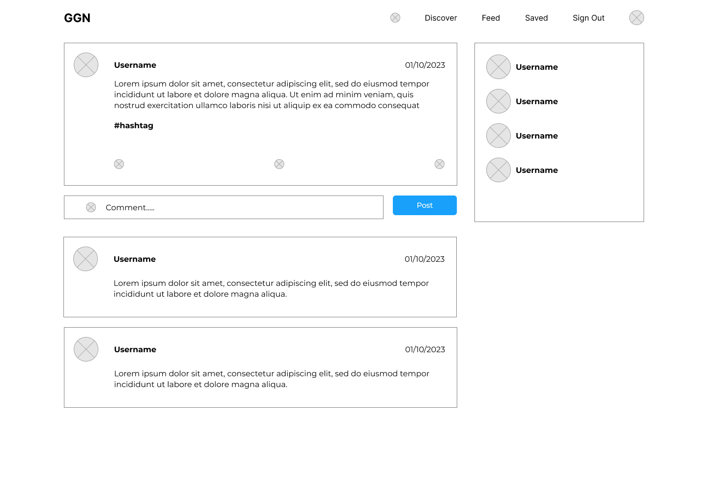
</details>

### React Components

#### NavBar

##### Description:
The NavBar component is responsible for rendering a navigation bar at the top of the web application. It adapts its content and behaviour based on the user’s authentication status. When a user is logged in, it displays links for various user-related actions and features, such as creating posts, discovering content, and signing out. When a user is logged out, it provides links for signing up and signing in.

##### Props:
None

##### Usage:
To use this component in your application, you can import it and place it within your application’s layout or wherever navigation is needed. Depending on the user’s authentication status, the NavBar component will dynamically display relevant links and actions.

```
<NavBar />
```

#### NotFound

##### Description:
The NotFound component is responsible for rendering a user-friendly “404 Not Found” error page in the web application. When a user navigates to a non-existent page or resource, this component is displayed to inform the user that the requested page cannot be found. It includes an image, a message, and a button to navigate back to the home page.

##### Props
None

##### Usage:
To use this component in your application, you can import it and display it whenever a 404 error is encountered. It provides a user-friendly way to handle cases when a page is not found.

```
<NotFound />
```

#### Home

##### Description:
The Home component represents the landing page of the web application. It provides an introduction to the application’s purpose, encouraging users to sign up. The page features a title, a brief description, and an image, all designed to create an inviting atmosphere for potential users.

##### Props
None

##### Usage:
This component is typically used as the initial landing page for the application. It’s where users first arrive when they access the application’s URL.

```
<Home />
```

#### DropDownMenu

##### Description:
The DropDownMenu component represents a generic dropdown menu typically used to provide options or actions for an item or element. It is designed to be a reusable dropdown menu component. When activated, it displays a toggle button with three dots (”…”) that, when clicked, opens a dropdown containing items like “Edit” and “Delete.”

##### Props
- handleEdit: A function to be executed when the “Edit” option is clicked.
- handleDelete: A function to be executed when the “Delete” option is clicked.

##### Usage:
This component can be used in various parts of the application to provide dropdown menus for items that need editing or deleting.

```
<DropDownMenu />
```

#### ProfileEditDropdown

##### Description:
The ProfileEditDropdown component is specifically designed for a profile editing menu. It provides options for editing a user’s profile, changing their username, and changing their password. The dropdown contains options with icons and labels, making it easy for users to navigate to different parts of their profile for editing.

##### Props
id: The ID of the user’s profile.

##### Usage:
This component can be used in the user profile section to provide a menu for editing various aspects of the user’s profile.

```
<ProfileEditDropdown />
```

#### Avatar

##### Description:
The Avatar component is responsible for displaying user avatars or profile pictures within the web application. It can display both an image (specified by the src prop) and optional text or additional content. The component allows customization of the avatar’s height and width.

##### Props
- src (string): The source URL of the image to be displayed as the avatar.
- height (number, optional): The height of the avatar image. Default is 45 pixels.
- text (string, optional): Additional text or content to be displayed alongside the avatar image.

##### Usage:
This component can be used to display user avatars or profile pictures throughout the application, customizing the avatar’s appearance and optionally adding associated text or content.

```
<Avatar />
```

#### Asset

##### Description:
The Asset component is a versatile component for rendering assets in a web application. It can display different types of content based on the props provided, including a loading spinner, an image, and an optional message. This flexibility makes it suitable for showing content while loading, images, or messages within different parts of the application.

##### Props
- spinner (boolean): Indicates whether to display a loading spinner (true) or not (false).
- src (string): The source URL of an image to display.
- message (string, optional): An optional message or text content to be displayed below the spinner or image

##### Usage:
This component can be used in various parts of the application to display different types of assets, whether it’s a loading spinner during data retrieval, images, or accompanying messages

```
<Asset />
```

## Features

### NavBar
- Depending on the user's sign-in status, the navigation links will vary.
- When the user is signed in, additional features and functionality will be accessible.

<details>
  <summary>Navbar Unregister</summary>
  
  
</details>

<details>
  <summary>Navbar register</summary>
  
  
</details>

### Home Page
- The homepage features an image introductory text designed to provide users with information about the site

<details>
  <summary>Home Page</summary>
  
  
</details>

### Discover Page
- The Discover page includes a search bar that enables users to search for posts or usernames.
- It also features a popular user section, allowing users to view the most followed users.
- Furthermore, all users' posts are displayed on the Discover page.

<details>
  <summary>Discover Page</summary>
  
  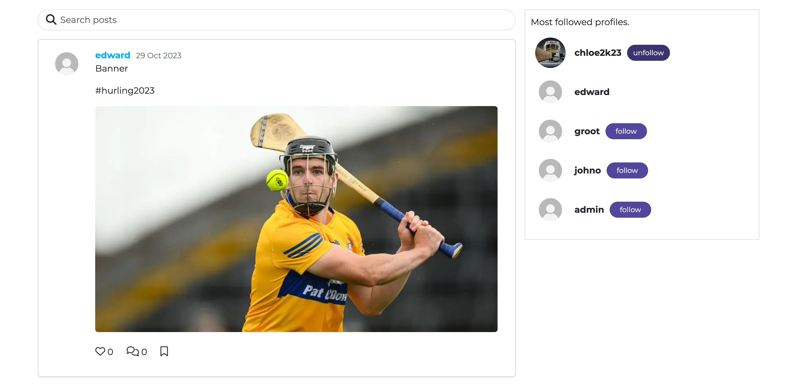
</details>

### Sign Up Page
- On the sign-up page, users will find a registration form requiring the input of a username and password.
- This form is equipped with validation mechanisms to assess the credibility of the provided information.

<details>
  <summary>Sign Up</summary>
  
  
</details>

### Sign In Page
- On the sign-in page, users will encounter a login form where they are prompted to enter a username and password.
- This form is equipped with validation mechanisms to verify the credibility of the provided information.

<details>
  <summary>Sign In</summary>
  
  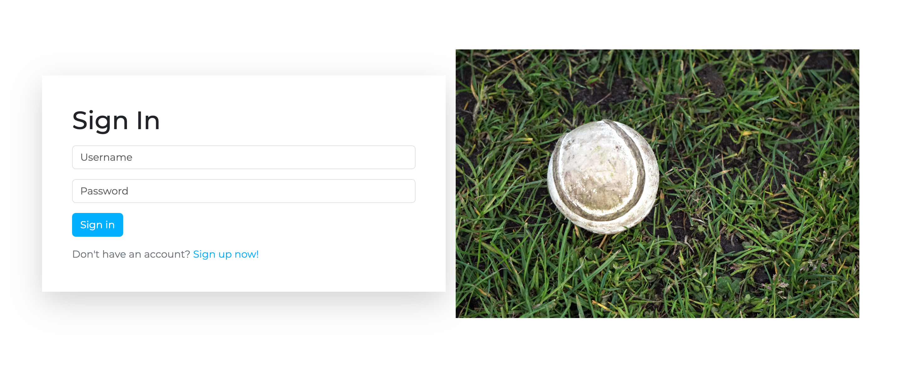
</details>

### Feed Page
- The feed page contains all posts from users that the user follows

<details>
  <summary>Feed</summary>
  
  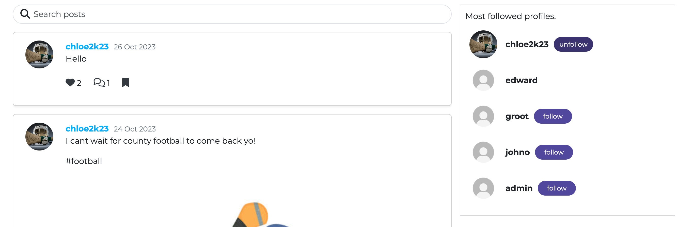
</details>

### Create Post
- The Create Post page includes a form where users can upload an image, share their thoughts, and add tags to their post.

<details>
  <summary>Create Post</summary>
  
  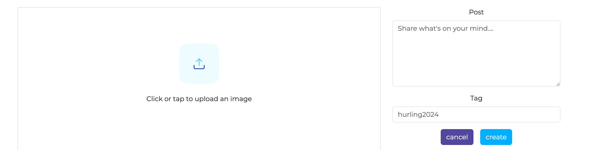
</details>

### Edit Post Page
- Users have the ability to edit their posts to make modifications or updates.
- Users also have the ability to delete a post

<details>
  <summary>Edit Post</summary>
  
  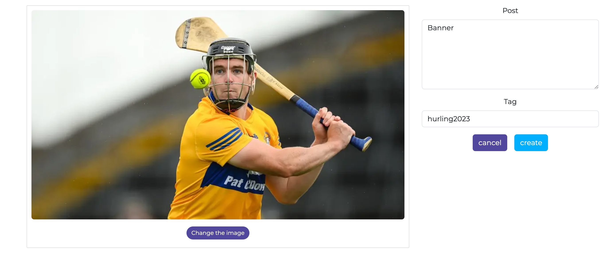
</details>

### Saved Posts Page
- Users can access a list of saved posts for viewing.

<details>
  <summary>Saved Posts</summary>
  
  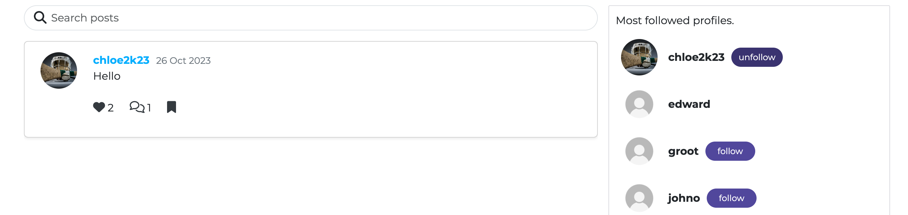
</details>

### Post Page
- Users can view individual posts and, if available, a list of comments on the page.
- If logged in, users can create comments.
- Additionally, users can edit their own comments if they have posted them.

<details>
  <summary>Post</summary>
  
  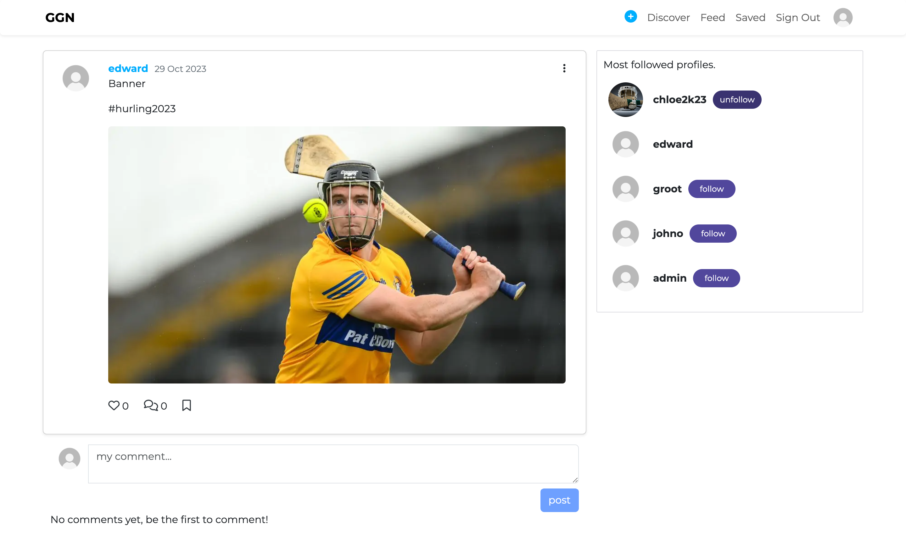
</details>

### Profile Page
- Users have a dedicated profile page where they can access their personal information.
- On this page, users can view their post count, as well as the number of users they follow and their followers.
- Users can also specify their supported country and club team.

<details>
  <summary>Profile</summary>
  
  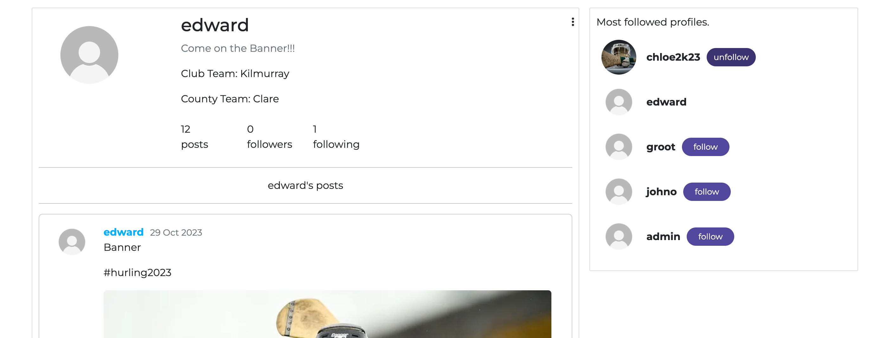
</details>

### Edit Profile
- Users have the option to edit their profile, allowing them to change their username, password, and personal details.

<details>
  <summary>Edit Profile</summary>
  
  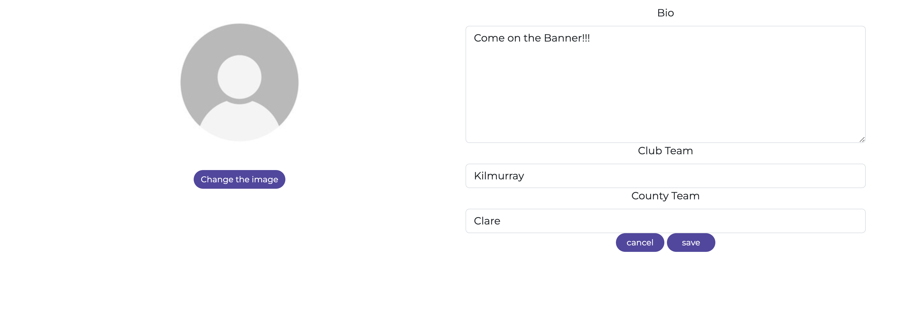
</details>

<details>
  <summary>Change Username</summary>
  
  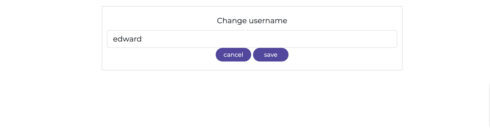
</details>

<details>
  <summary>Change Password</summary>
  
  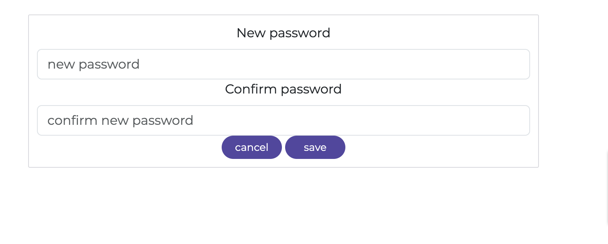
</details>

## Languages and Frameworks

### Languages
- Python3
- JavaScript
- HTML and CSS

### Frameworks
- Django
- React
- Bootstrap

### Libraries Used
- django-3.2.22
- django-cloudinary-storage-0.3.0
- Pillow-8.2.0
- djangorestframework==3.12.4
- django-filter-23.2
- dj-rest-auth==2.1.9
- dj-rest-auth[with_social]
- djangorestframework-simplejwt==4.7.2
- dj_database_url
- gunicorn
- django-cors-headers
- psycopg2
- urllib3==1.26.15
- react==17.0.2
- react-bootstrap
- react-infinite-scroll-component
- msw
- jwt-decode
- eslint
- whitenoise==6.4.0
